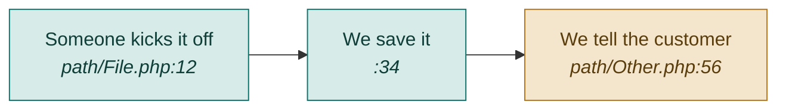

# <Feature Name>

**One line:** <what this feature does, in the user's language — one sentence.>

- **Mode:** <plan / fix / explain> · **Status:** <planned / WIP / shipped> · commit `<sha>` · branch `<branch>`
- **Visual doc:** [`<slug>.dashboard.html`](<slug>.dashboard.html) — open it in a browser (not published anywhere)
- **Tasks, tests & tech debt:** `kanban/tasks/` — run `kanban-md list --compact --tag <area>`

## What's going wrong  <!-- FIX MODE ONLY — delete this section for plan/explain runs -->

<!-- Only fill this in once the cause is PROVEN via superpowers:systematic-debugging. -->

- **What you see:** <plain sentence: the symptom a person actually observes.>
- **Why it happens:** <plain sentence naming the proven cause + `file:line`.>
- **What to do:** <numbered plain steps, ending with the regression test that would have caught it.>

## Flow

<!-- Validate this renders before committing. PLAIN ENGLISH labels: say what happens
     ("A customer emails us"), not the layer name ("Webhook in"). Put file:line in <i>…</i>.
     Use classDef colors so related stages read as a group. GitHub renders this block inline.
     FIX MODE: mark the step that breaks, e.g. class B broken; with a red classDef. -->

## Screens

<!-- Same screenshots as the dashboard, so the git-tracked doc stands alone.
     PNGs live in docs/features/evidence/<slug>-<what>.png. -->

| Screen | What to look at |
|---|---|
|  | <plain sentence: what this proves / what to notice.> |

## What "done" means (test areas)

<!-- Each line is objectively checkable and carries a CONCRETE example.
     "validation works" is useless; "bad reply_to → 422" is a test.
     Any line not yet true of the code carries the id of its kanban card. -->

- [ ] **<Criterion>** — <concrete example of the pass condition> · `#<card id>`
- [ ] **<Criterion>** — <concrete example>
- [ ] **<Criterion>** — <concrete example>

## Tests

<!-- Every DoD line must be reachable from at least one row here.
     Unit/feature → tests/phpunit/tests/*Test.php (npm run test:unit)
     E2E          → tests/e2e/*.spec.js          (npm run test:e2e) -->

| # | Kind | What it proves | Target file | Status |
|---|------|----------------|-------------|--------|
| <id> | unit | <plain sentence> | `tests/phpunit/tests/<Thing>Test.php` | to write / written |
| <id> | feature | <plain sentence> | `tests/phpunit/tests/<Thing>Test.php` | to write / written |
| <id> | e2e | <plain sentence> | `tests/e2e/<feature>.spec.js` | to write / written |

## Known gaps & debt

<!-- Mirrors the kanban cards. Keep it in sync when the board changes.
     EXPLAIN MODE: this is the "what's undone" answer — it must not be empty
     unless you genuinely found nothing left. -->

| # | Item | Priority |
|---|------|----------|
| <id> | <one-line description + file:line> | critical / high / medium |
