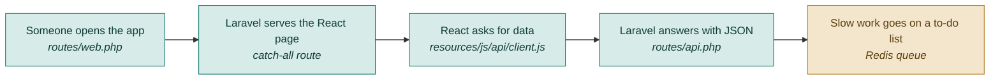

# F00 — Setup and app shell

**One line:** One application that answers data requests at `/api/*` and serves the React screens for every other address.

- **Mode:** build · **Status:** built · DropSense adds the rename · **Epic:** `#67`
- **Spec:** [`../superpowers/specs/2026-08-03-dropsense-ai-design.md`](../superpowers/specs/2026-08-03-dropsense-ai-design.md)
- **Tasks:** `kanban-md list --compact --tag f00-setup`

> **The rename (`#124`) is user-facing only.** App name, titles, nav, README, PDF header
> and these docs say DropSense AI; *health score* becomes *Conversion Score* wherever a
> user can read it. Class names, table names and routes do not move. Renaming a working
> pipeline mid-week is a day of churn with a real chance of breaking the demo path, and
> no judge reads a namespace.

## Flow

**Why one repository, two applications.** Laravel does exactly two jobs — answer JSON at
`/api/*`, and serve React's `index.html` for every other address. React draws all the
screens. One repository means one deploy, one place to look when something breaks, and
you still get a real React codebase you could split out later.

## What "done" means

- [ ] **The repo has history** — `git log` shows commits from day 1, not one dump on day 7 · `#78`
- [ ] **The app boots** — you open it in a browser and land on an empty Pages screen that fetched from the API · `#79`
- [ ] **Refreshing a deep link works** — reload the browser on `/audits/42` and you get the React app, not a Laravel 404 · `#79`
- [ ] **Errors surface once, centrally** — a failing request shows one toast, and no individual component contains error-handling code · `#79`
- [ ] **The queue runs** — the worker is up and Horizon reports zero jobs · `#80`
- [ ] **The robot browser is installed** — `npx playwright --version` answers, and Chromium is downloaded · `#80`

## Tests

No automated tests for this feature. It is scaffolding: if it is broken, nothing else
runs, so every other test is its own proof. Verify by hand against the checklist above.

## Known gaps and debt

| # | Item | Priority |
|---|---|---|
| `#113` | No login. Anyone who can reach the app sees every page and every audit | critical |
| — | Horizon is a build-week debugging tool, not a V1 feature. Do not put it in the demo | — |
