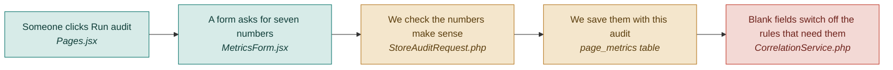

# F02 — Metrics input form

**One line:** A short form of numbers from analytics — arriving already filled in from the demo dataset, and still editable.

- **Mode:** build · **Status:** V1 form built · DropSense adds the fixture and the pre-fill · **Epic:** `#69`
- **Spec:** [`../superpowers/specs/2026-08-03-dropsense-ai-design.md`](../superpowers/specs/2026-08-03-dropsense-ai-design.md)
- **Tasks:** `kanban-md list --compact --tag f02-metrics`

> **The demo flow is paste URL → Analyze, with no typing. That is not achieved by
> deleting the form.** It is achieved by arriving with it filled in.

## Flow

**Why a form and not Google Analytics.** Google Analytics does export reports as CSV, but
its export carries comment lines above the table and column names that shift by report.
More importantly, it does not contain the two numbers the rules care about most —
scroll depth per section, and how often the main button is clicked (which needs an event
most landing pages never set up). So V1 asks directly. Pulling from Google Analytics is
`#117`.

**Why at audit time, not on the page record.** The numbers change every week. The page
does not.

## Where the numbers come from on stage (`#125` `#126`)

`config/demo-analytics.php` holds one realistic dataset — the seven GA4-shaped numbers
plus per-section rage clicks and dead clicks from the Clarity side. `GET /api/demo-metrics`
serves it, and the demo seeder reads the same file, so **what is shown on stage and what
ships in the seed cannot drift apart**.

After adding a page, the form arrives with those values already in it. The user presses
Analyze and nothing else.

**Why the numbers stay visible and editable.** Hiding them would buy a marginally
cleaner flow and cost two things worth more: the tool could no longer be pointed at a
real page with real numbers, and a judge asking *whose numbers are these?* would have no
answer on screen. `page_metrics.source` records `demo` or `manual`, and **the report
header prints which**.

The evidence guarantee is unaffected — an insight still has to name a metric, a number
and a section. The honesty comes from labelling the source, not from concealing it.

## The seven fields

| Field | Required | What it switches on |
|---|---|---|
| Visitors | yes | How much weight a section's problems carry in the ranking |
| Bounce rate | yes | The trust rule, and the user-experience score |
| Conversion rate | yes | Context at the top of the report |
| Main button click rate | no | The seen-but-not-clicked rule |
| Share of visitors on a phone | no | The mobile rule |
| Bounce rate on a phone | no | The mobile rule |
| How far down each section people get | no | The buried-section rule |

Plus two from the Clarity side of the fixture, added in DropSense:

| Field | Required | What it switches on |
|---|---|---|
| Rage clicks per section | no | The rule about clicking something that is not a button |
| Dead clicks per section | no | The same rule |

## What "done" means

- [ ] **Three fields are enough** — an audit runs with only visitors, bounce rate and conversion rate filled in · `#82` `#86`
- [ ] **A blank field is never a guess** — leave the button click rate blank and the seen-but-not-clicked rule does not fire at all; the report says not measured · `#82` `#86`
- [ ] **Nonsense is rejected** — a bounce rate of 150 returns a field error, not a saved row · `#82`
- [ ] **Every number is explained** — each field carries a one-line plain-English note saying what it means, e.g. bounce rate is the share of visitors who arrive and leave without doing anything · `#86`
- [ ] **Optional fields say what they cost** — each optional field says in one line what stops working if it is left blank · `#86`
- [ ] **The demo needs no typing** — add a page, and the form is already filled from the fixture · `#125` `#126`
- [ ] **The source is on the report** — the header says whether the numbers were demo data or typed in · `#126`
- [ ] **They are still editable** — overwrite a demo number live and the audit uses what was typed · `#126`
- [ ] **The seed and the stage agree** — the seeder and the endpoint read the same file · `#125`

## Tests

| # | Kind | What it proves | Target file |
|---|---|---|---|
| `#110` | feature | Only the three required fields are needed; a bounce rate of 150 returns 422 | `tests/Feature/AuditEndpointsTest.php` |
| `#106` | unit | A blank button click rate makes the seen-but-not-clicked rule silent rather than assuming a value | `tests/Unit/Correlation/SeenButNotClickedRuleTest.php` |
| `#112` | e2e | Running an audit with every optional field blank produces a report that says not measured | `tests/e2e/unhappy-path.spec.ts` |

## Known gaps and debt

| # | Item | Priority |
|---|---|---|
| `#117` | Pulling the numbers from Google Analytics instead of typing them | medium |
| `#118` | The **live** Microsoft Clarity API. DropSense supplies rage and dead clicks from the fixture; the API behind them is still V2 | medium |
| `#142` | The JavaScript tracker that would replace the fixture entirely — the only thing that gives per-section scroll depth and a real button click rate without custom GA4 events | low |
| — | Demo numbers are demo numbers. They are labelled on screen rather than hidden, but a judge who wants a real-data audit needs a page whose analytics you actually have | medium |
| — | Per-section reach is entered as free text in V1. It becomes tedious past three or four sections | medium |
