# F03 — Audit pipeline and progress

**One line:** The four background stages that turn a web address and seven numbers into a finished report, and the progress bar that says where it has got to.

- **Mode:** plan · **Status:** planned — nothing built yet · **Epic:** `#70`
- **Visual doc:** [`v1.dashboard.html`](v1.dashboard.html) — open it in a browser
- **Tasks:** `kanban-md list --compact --tag f03-pipeline`

## Flow

```mermaid
flowchart LR
    A["Someone clicks Run audit<br/><i>AuditController.php</i>"] --> B["We photograph the page<br/><i>CaptureScreenshotsJob</i>"]
    B --> C["The AI looks at every section<br/><i>AnalyzePageJob</i>"]
    C --> D["We join the numbers to the pictures<br/><i>CorrelateJob</i>"]
    D --> E["We rank the fixes and give a score<br/><i>RankAndScoreJob</i>"]
    E --> F["The report appears on screen<br/><i>Report.jsx</i>"]
    classDef edge fill:#d7ebe8,stroke:#0f766e,color:#0f3d38;
    classDef work fill:#f4e6cc,stroke:#b5771f,color:#5a3d0d;
    classDef heart fill:#f3d9d5,stroke:#c0392b,color:#6d211a;
    class A,F edge;
    class B,C,E work;
    class D heart;
```

**Why a chain and not a batch.** Each stage needs the rows the previous stage wrote, and
a failure has to stop everything after it. A half-finished audit that looks complete is
worse than one that says it failed.

**Why nobody waits.** Starting an audit returns immediately with a status of pending.
The browser then asks *is it finished yet?* every five seconds and stops on its own when
it reads completed or failed. Over three minutes that is about 36 tiny requests — not a
problem worth solving with websockets in V1.

**The four stages, and what the progress bar says:**

| Stage | The bar reads |
|---|---|
| `CaptureScreenshotsJob` | taking pictures |
| `AnalyzePageJob` | the AI is looking |
| `CorrelateJob` | joining the dots |
| `RankAndScoreJob` | ranking the fixes |

## What "done" means

- [ ] **Nobody waits on a spinner** — clicking Run audit returns in under a second with a status of pending · `#83`
- [ ] **The bar tells the truth** — it names the stage actually running, not a generic spinner · `#87`
- [ ] **Polling stops by itself** — the browser stops asking as soon as the audit reads completed or failed · `#87`
- [ ] **No audit is ever stuck on running** — kill the worker mid-audit and, within the timeout, the audit reads failed · `#84`
- [ ] **A failure is readable** — the screen shows a plain sentence, not a stack trace, plus a Try again button · `#84` `#103`
- [ ] **A permanently broken page does not loop** — retries are capped · `#84`

## Tests

| # | Kind | What it proves | Target file |
|---|---|---|---|
| `#110` | feature | Starting an audit returns 201 pending and queues the chain; polling returns the current stage | `tests/Feature/AuditEndpointsTest.php` |
| `#112` | e2e | An unreachable URL leaves a readable failure and a Try again button, never a stuck audit | `tests/e2e/unhappy-path.spec.ts` |
| `#111` | e2e | The happy path: submit, watch the bar name a real stage, see the report | `tests/e2e/audit-flow.spec.ts` |

## Known gaps and debt

| # | Item | Priority |
|---|---|---|
| `#115` | Nothing rate-limits audits, so twelve clicks is twelve AI calls and twelve rounds of Chromium | high |
| `#120` | No weekly schedule and no email — the plan's set-and-forget promise is not in V1 | medium |
| — | Chromium needs roughly 2 GB of memory on the machine running the worker | — |
