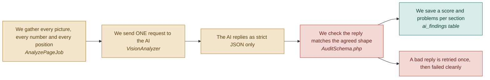

# F05 — AI vision analysis

**One line:** One AI call looks at every section of the page at once, with the visitor numbers attached, and says what is wrong.

- **Mode:** plan · **Status:** planned — nothing built yet · **Epic:** `#72`
- **Visual doc:** [`v1.dashboard.html`](v1.dashboard.html) — open it in a browser
- **Tasks:** `kanban-md list --compact --tag f05-ai-vision`

## Flow

## The clever bit, and the cheap bit

**The AI never looks at a picture alone.** Every image arrives with its own numbers
attached — *82% of visitors saw this section, only 2% clicked the button*. That pairing
is what turns a design opinion into evidence.

**One call, not thirteen.** The original plan sent one request per section per screen
size, plus a separate whole-page request — thirteen in total, each re-sending the same
~1,500-word instruction. Sending everything in one request costs roughly a quarter as
much *and* gives the model the whole-page view the separate request was there to buy.

| Shape | Requests | Rough cost per audit |
|---|---|---|
| One request per section, plus a whole-page pass | 13 | ~$0.22 |
| **One request, everything together** | **1** | **~$0.055** |

The second cost lever lives in F04: shrinking images to 1568px before sending. A
full-size image can cost around three times as many image tokens as a shrunk one, and
judging whether a button has enough contrast does not need the extra pixels.

## Two models, one prompt

`VisionAnalyzer` is an interface with two drivers sharing one instruction and one reply
shape. Only the HTTP client differs; pick with `AI_DRIVER` in `.env`.

| Driver | Model | Used for |
|---|---|---|
| `GeminiVisionAnalyzer` | Gemini 3.6 Flash (`GEMINI_MODEL`) | The build week |
| `ClaudeVisionAnalyzer` | Claude Sonnet 5 | The demo |

`gemini-2.5-flash` still appears in the models list but returns 404 to accounts that
had not already used it — *"no longer available to new users"*. The default is now
`gemini-3.6-flash`; `gemini-flash-latest`, `gemini-3.5-flash` and `gemini-3.1-flash-lite`
also accept the schema.

**Cost on a thinking model.** Gemini reports what it thought in
`usageMetadata.thoughtsTokenCount`, separately from the visible reply, and bills both as
output. On one real audit that was 534 thinking tokens against 89 of reply — so counting
only `candidatesTokenCount` understated the bill roughly sixfold, and the per-audit
ceiling was being enforced against the understated figure. Both are now summed. The
per-million rates moved out of the class into `GEMINI_INPUT_PER_MILLION` /
`GEMINI_OUTPUT_PER_MILLION`, because they differ per model and the defaults are still
the 2.5-flash card.

**What the AI is asked to judge:** layout and hierarchy, the main button (visible,
large enough, enough contrast, clear words), typography, design consistency and mobile
friendliness, trust signals, and content clarity.

**What each problem must come back with:** what is wrong, why it costs conversions,
what to change, and how bad it is on a scale of one to five. F07 composes the
user-facing fix out of those four fields — there is no second AI call.

## Findings have to land on the section they are about

A finding whose `section` does not match a captured section gets no
`screenshot_section_id`, so correlation has no section to attach a number to, so the
evidence guarantee discards it. Correctly — but silently, and the report then says
*nothing could be proven* about a page the model described accurately.

This never showed on the stub driver, because `StubVisionAnalyzer` reads the section
names out of the database and so matches by construction. The first real Gemini run
lost three findings of four: the capture had named sections after the headings it found
(`Section 1`, `WP`, `Our Contributions`), and the model named them after what it saw
(`Hero Section`, `Product Showcase`, `Mobile Experience`).

Two changes, and both are needed:

1. **The prompt hands over the captured names** and requires them back character for
   character, saying plainly that an unlisted name is thrown away. It also says where a
   phone-only problem goes, since the mobile shot has no section of its own and a model
   with something to say about phones will otherwise invent one.
2. **`SectionMatcher` is the safety net** for a reply that ignores the instruction. It
   matches case- and punctuation-insensitively, and on whole-word runs in either
   direction, so a capture truncated to `We Provide Tech Solutions & Help You to` still
   catches the model writing the sentence out in full. It compares words rather than
   characters, so `WP` does not match `WPBakery`. **Two candidates means no match** — a
   wrong link would put a real number beside the wrong part of the page, which is worse
   than one finding fewer.

`audits.unmatched_findings` counts what could not be placed, and the job logs a warning
naming both lists. The point is that this failure can never again be silent.

## What "done" means

- [ ] **Exactly one AI request per audit** — the log shows a single vision call, and the audit's token cost is recorded · `#92`
- [ ] **The AI says something specific** — every section has a score from 0 to 100 and at least one problem naming an actual element, not generic advice like improve your design · `#92`
- [ ] **A malformed reply is rejected, not half-saved** — feed it a reply missing a severity field; it retries once, then fails cleanly, and no findings rows are written · `#92` `#109`
- [ ] **Swapping the model is one line** — flipping `AI_DRIVER` between gemini and claude changes nothing else · `#91`
- [ ] **You know what an audit costs** — the token cost is stored per audit, before anyone asks · `#92`

## Tests

| # | Kind | What it proves | Target file |
|---|---|---|---|
| `#109` | unit | A well-formed reply validates; missing fields, out-of-range scores and non-JSON are all rejected without writing rows | `tests/Unit/Ai/AuditSchemaTest.php` |
| `#111` | e2e | Section cards show a score and a specific problem after a real run | `tests/e2e/audit-flow.spec.ts` |
| — | unit | A name is matched through case, punctuation and truncation, and refused when it was invented or when two sections would fit | `tests/Unit/Ai/SectionMatcherTest.php` |
| — | feature | The prompt lists the captured names and forbids inventing one | `tests/Feature/PromptNamesSectionsTest.php` |
| — | feature | Findings land on their section; an invented name stays unlinked rather than guessed, and the count is recorded | `tests/Feature/FindingsLandOnSectionsTest.php` |
| — | feature | Thinking tokens are billed as output, and the rates are configurable | `tests/Feature/GeminiCostTest.php` |

## Known gaps and debt

| # | Item | Priority |
|---|---|---|
| `#115` | Nothing rate-limits how often an audit can run. The per-audit ceiling now exists (`AI_MAX_COST_PER_AUDIT`) and is enforced on a figure that includes thinking tokens | high |
| — | The default per-million rates are still the gemini-2.5-flash card. Anyone setting `GEMINI_MODEL` to a 3.x model should check the current rate card and set `GEMINI_INPUT_PER_MILLION` / `GEMINI_OUTPUT_PER_MILLION`, or the recorded cost — and the ceiling — will be wrong | medium |
| — | `SectionMatcher` refuses when two sections would fit rather than choosing. On a page whose sections share a heading that costs a finding. Preferring the longest overlap would recover some, but only with evidence that it does not mislink | low |
| — | **Biggest open risk in the project:** the model writing the critique *is* the demo. Whichever driver you present with must be run against at least four real landing pages, and the output read as a judge would read it. Day 6 is reserved for exactly this | critical |
| — | Free-tier requests are rate-limited and free-tier data may be used for product improvement. Fine for public landing pages; check the current quota page before relying on it | medium |
