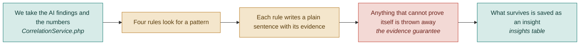

# F06 — Correlation engine

**One line:** Five rules that join a number to a visual cause — the reason this tool exists, and the only part of it a judge will remember.

- **Mode:** build · **Status:** four rules built · DropSense adds the fifth · **Epic:** `#73`
- **Spec:** [`../superpowers/specs/2026-08-03-dropsense-ai-design.md`](../superpowers/specs/2026-08-03-dropsense-ai-design.md)
- **Tasks:** `kanban-md list --compact --tag f06-correlation`

> Everything before this feature is data collection. Everything after it is
> presentation. If this is not convincing, nothing else matters.

## Flow

**Why rules before AI.** You can write a test that proves *seen but not clicked* fires
correctly. You cannot test an opinion. Rules are also free — the AI has already been
paid for in F05.

## The five rules

| Rule | The numbers say | And the picture shows | So we conclude |
|---|---|---|---|
| `SeenButNotClicked` `#94` | 80% see the hero, 2% click | The button has weak contrast and vague wording | People find the button and ignore it. Fix the button, not the traffic |
| `DropOffBeforeSection` `#95` | Only 20% reach Pricing | Three long sections sit above it | Pricing is buried. Move it up, or add a second button earlier |
| `MobileGap` `#96` | Phone bounce is twice desktop | Phone text is tiny and the button is below the fold | The phone layout is the leak. Fix mobile before anything else |
| `TrustGapEarly` `#97` | Bounce is high, most people never scroll far | No testimonial, logo or badge above the fold | Visitors leave before they believe you. Add proof early |
| `RageClickMismatch` `#134` | Lots of rage and dead clicks here, and the button click rate is still low | An image or card carries a hover effect but no link | People are clicking something that is not a button. The thing that looks clickable isn't, and the thing that is doesn't look it |

`TrustGapEarly` was written for V1 because the rage-click rule needed Clarity data V1 did
not collect. **DropSense's demo fixture supplies rage and dead clicks (`#125`), so the
fifth rule ships too.** Both rules stay. The live Clarity API behind the data is still
V2 — `#118`.

## The evidence guarantee

**An insight without a metric, a number and a section name is discarded — not
downgraded, not shown with a caveat. Discarded.**

This lives in one method, `CorrelationService::filterUnevidenced()`, with its own test
(`#107`), so it cannot be quietly bypassed later. It is what stops the tool degenerating
into a generic design-tips generator, and it is what makes the demo land: a judge can
point at any line on screen and it will name a real number.

## What "done" means

- [ ] **Pick any insight at random and it proves itself** — it names a metric, a number and a section. No insight is a generic design tip · `#93` `#107`
- [ ] **A rule with no data stays silent** — leave the button click rate blank and `SeenButNotClicked` does not fire at all · `#94` `#106`
- [ ] **Each rule fires on the right shape and only that shape** — 80% reach with a 2% click rate fires; 80% reach with a 25% click rate does not · `#94` `#106`
- [ ] **Buried sections use measured positions** — the rule reads the position recorded during capture, not an estimate · `#95`
- [ ] **The mobile rule needs both halves** — a bad phone bounce rate alone is not enough; the AI must also have flagged something phone-specific · `#96`
- [ ] **An audit where nothing is provable shows nothing** — an empty list, not a placeholder insight · `#93` `#107`
- [ ] **The rage-click rule needs both halves** — high rage clicks alone is not enough; the button click rate must also be low · `#134` `#135`
- [ ] **No rage-click data keeps it silent** — it stays quiet rather than assuming zero · `#134` `#135`

## Tests

| # | Kind | What it proves | Target file |
|---|---|---|---|
| `#106` | unit | All four V1 rules fire on the right shape, stay quiet on the wrong one, and stay silent when their data is blank | `tests/Unit/Correlation/*RuleTest.php` |
| `#135` | unit | `RageClickMismatch` held to the same bar | `tests/Unit/Correlation/RageClickMismatchRuleTest.php` |
| `#107` | unit | An insight missing a metric, a number or a section name is discarded, not downgraded | `tests/Unit/Correlation/CorrelationServiceTest.php` |
| `#111` | e2e | Every fix shown on the report screen carries a number as evidence | `tests/e2e/audit-flow.spec.ts` |

## Known gaps and debt

| # | Item | Priority |
|---|---|---|
| `#118` | The **live** Microsoft Clarity API. The rule it was blocking now ships on fixture data — what is left is the real feed behind it | medium |
| — | Five rules is still a small library. The whole-page AI pass in the original plan existed to catch what rules cannot see; DropSense folds that into the single F05 call rather than paying for a second one | medium |
| — | `RageClickMismatch` fires on demo rage-click numbers. Until `#118` or `#142` lands, that particular rule has never been tested against a real visitor | medium |
