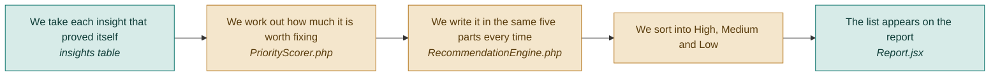

# F07 — Recommendations and priority

**One line:** Turn each insight into a fix a designer can start today, ranked by how much money it is likely to make.

- **Mode:** plan · **Status:** planned — nothing built yet · **Epic:** `#74`
- **Visual doc:** [`v1.dashboard.html`](v1.dashboard.html) — open it in a browser
- **Tasks:** `kanban-md list --compact --tag f07-recommendations`

## Flow



**No second AI call.** The problem and the suggested fix come from the AI finding
written in F05. The evidence comes from the rule that fired in F06. The priority is
arithmetic. Nothing here costs money.

## The five parts, always in this order

People learn to read them fast because they never move.

| Part | Example |
|---|---|
| **Problem** | The main button is hard to see |
| **Evidence** | 82% of visitors see the hero. 2% click |
| **Suggested fix** | Raise button contrast to at least 4.5:1 and move it above the fold |
| **Expected impact** | Button clicks 2% → 4–6% |
| **Priority** | High |

**Impact is always a range, never a single number.** A range is honest. A precise
prediction is not.

## How priority is worked out

```
priority = (traffic share × severity × confidence) ÷ effort
```

- **Traffic share** — how many visitors actually reach that section (1.0 when the user did not supply per-section reach)
- **Severity** — how badly it blocks the goal, 1 to 5, from the AI
- **Confidence** — how sure the evidence is, 0 to 1, from the rule that fired
- **Effort** — a rough build estimate, 1 to 5

A score, not a feeling, so two people reading the same audit agree. **A small problem on
a section 90% of people see should beat a big problem on a section 5% reach** — that is
the exact case the test pins down.

Three buckets only: High, Medium, Low. More would be noise.

## What "done" means

- [ ] **The ranking is defensible** — a small problem on a section 90% of people see outranks a big problem on a section 5% reach · `#98` `#108`
- [ ] **Missing reach does not zero out a section** — no per-section reach falls back to a traffic share of 1.0, not 0 · `#98` `#108`
- [ ] **Exactly three buckets** — never a fourth, never an unlabelled item · `#98` `#108`
- [ ] **Every fix has all five parts** — problem, evidence with a number, suggested fix, expected impact as a range, priority label · `#99`
- [ ] **The top item passes the human test** — show the list to someone and they agree it is genuinely the thing they would fix first · `#99`

## Tests

| # | Kind | What it proves | Target file |
|---|---|---|---|
| `#108` | unit | Traffic share dominates raw severity; missing reach falls back to 1.0; exactly three buckets | `tests/Unit/PriorityScorerTest.php` |
| `#111` | e2e | Each fix on screen shows all five parts and a priority label | `tests/e2e/audit-flow.spec.ts` |

## Known gaps and debt

| # | Item | Priority |
|---|---|---|
| `#119` | No way to tick a fix as done, so the next audit cannot measure whether it worked | medium |
| `#121` | The plan's separate priority-tasks screen is not in V1; the ranked list lives on the report | low |
| — | Effort is currently the AI's estimate. It is the weakest input in the formula — a wrong effort skews the ranking more than a wrong severity does | medium |
