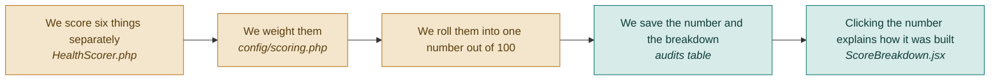

# F08 — Conversion Score

**One line:** One number out of 100 for the whole page, built from six weighted categories that are visible in the app so nobody thinks the number is magic.

- **Mode:** build · **Status:** V1 score built · DropSense renames it and measures two of the six · **Epic:** `#75`
- **Spec:** [`../superpowers/specs/2026-08-03-dropsense-ai-design.md`](../superpowers/specs/2026-08-03-dropsense-ai-design.md)
- **Tasks:** `kanban-md list --compact --tag f08-score`

> Called the **health score** in V1 and in the code. `HealthScorer` keeps its class name;
> the rename is user-facing only (`#124`).

## Flow

## The six categories

| Category | Weight | Where the score comes from |
|---|---|---|
| Main button effectiveness | 25% | AI judgment plus the real click rate |
| User experience | 20% | Bounce rate and how far down people get |
| Visual design | 20% | AI judgment across every section |
| Trust | 15% | AI judgment — testimonials, logos, badges |
| Speed | 10% | **Lighthouse performance score** `#133` |
| Accessibility | 10% | **Lighthouse accessibility score** `#133` |

The weights live in `config/scoring.php` and are shown in the app. A number nobody can
take apart is a number nobody should trust.

**The weights did not move.** Only the source of the bottom two changed.

## What the number is actually for

**79 means nothing on its own. 79 last month and 86 today means the fixes worked.**

V1 can only ever show the first half of that sentence, because it has one audit per
page. The comparison — the score's real job — arrives with `#119`. Worth saying out
loud on stage rather than implying the single number carries more meaning than it does.

## The honesty problem, and how DropSense fixes it

V1 shipped with a caveat printed in the report: **the accessibility score is an AI
approximation, not an accessibility audit** — a vision model judging contrast and font
size. Speed had the same weakness: one load timing, not a performance audit.

DropSense runs Lighthouse in the browser that is already open during capture (`#129`),
which is exactly what `#116` asked for. Both categories become measurements.

**So the caveat is deleted, because it stops being true** (`#133`). Deleting a caveat is
only honest when the thing it warned about has actually gone — that is the whole point
of doing `#129` before `#133`.

**When Lighthouse is missing** — it timed out, it crashed, the column is null — those
two categories fall back to V1 behaviour and the breakdown marks them **estimated**
rather than **measured**. The score never silently changes meaning.

## What "done" means

- [ ] **The score shows its working** — clicking the number lists all six categories, their weights and their individual scores · `#100`
- [ ] **The weights add up** — the six weights sum to exactly 100 · `#100` `#108`
- [ ] **The total is the weighted average** — recompute by hand from the breakdown and get the same number, rounded · `#100` `#108`
- [ ] **Missing data does not silently score zero** — a category with nothing to judge is excluded rather than dragging the total down · `#100` `#108`
- [ ] **Every row says where it came from** — measured for the two Lighthouse categories, estimated when Lighthouse is missing. Shown in the interface, not only in this document · `#100` `#133`
- [ ] **The caveat is gone** — with Lighthouse present, the report no longer says the accessibility score is an approximation, because it no longer is · `#133`
- [ ] **A missing Lighthouse run degrades, never fails** — null column, audit still completes, two rows read estimated · `#133` `#137`
- [ ] **It is called the Conversion Score** — everywhere a user can read it · `#124`

## Tests

| # | Kind | What it proves | Target file |
|---|---|---|---|
| `#108` | unit | Weights sum to 100; the total is the weighted average, rounded; a data-less category does not score zero | `tests/Unit/HealthScorerTest.php` |
| `#137` | unit | A null Lighthouse block falls back to V1 scoring and marks two rows estimated | `tests/Unit/HealthScorerTest.php` |
| `#110` | feature | The report response carries both the overall score and the per-category breakdown | `tests/Feature/AuditEndpointsTest.php` |

## Known gaps and debt

| # | Item | Priority |
|---|---|---|
| `#116` | **Closed by `#129` + `#133`** — Lighthouse now runs in the browser that is already open. Keep the card until those land | high |
| `#119` | No score history, so the comparison the number exists for cannot be shown | medium |
| — | Lighthouse accessibility catches what can be checked mechanically. It is far better than a vision model's guess and still not a manual accessibility review | medium |
| — | The four categories fed by AI judgment — button, experience, design, trust — are still opinions with numbers attached. That is 80% of the weight | medium |
