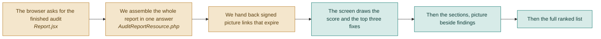

# F09 — Report screen

**One line:** The one screen the demo lives on: the score, the three fixes that matter most, the section pictures next to what is wrong with them, then the full ranked list.

- **Mode:** build · **Status:** V1 screen built · DropSense adds the rewrite panel and a design pass · **Epic:** `#76`
- **Spec:** [`../superpowers/specs/2026-08-03-dropsense-ai-design.md`](../superpowers/specs/2026-08-03-dropsense-ai-design.md)
- **Tasks:** `kanban-md list --compact --tag f09-report`

> **Beautiful dashboard** is one of the five stated winning points, and this is the screen
> it means. One day (`#139`) goes here and nowhere else — the Pages screen inherits the
> same tokens and gets no bespoke work, because it is on screen for about ten seconds.

## Flow

**One request, not ten.** The whole report comes back in a single answer of roughly
40 KB. Splitting it into ten tidy endpoints feels cleaner and makes the screen visibly
slower.

## What the screen shows, in this order

1. **The Conversion Score, with the three highest-priority fixes right underneath it**,
   and the metrics strip with its source labelled — demo data or typed in (`#126`).
   Someone who reads only this far still knows what to do.
2. **Section cards** — the picture on the left, the score and findings on the right.
   Seeing the picture next to the words is what makes the advice believable. Where a
   section has crawled copy, its headline and button appear **as text**, each with a
   **Rewrite this** button (`#132`).
3. **The full ranked list**, grouped High / Medium / Low.
4. **The score breakdown** — six categories, each marked measured or estimated — and
   **the download button.**

### The four things worth designing properly (`#139`)

The score dial, the section card, the rewrite panel and the priority chips. Everything
else on the screen is type and spacing.

## Two rules for this screen

- **No number appears without a sentence saying what it means.**
- **Every number is clickable and leads to the finding that explains it.**

A screen that only shows numbers is the exact problem this product was built to solve.

**And no internal vocabulary.** Users manage *landing pages* and see *fixes* — not
*entities* and *recommendation records*. Buttons say what happens (*Run audit*, not
*Submit*) and keep the same name through the whole flow.

## What "done" means

- [ ] **Someone untrained gets it in two minutes** — show it to a person who has never seen the tool; they correctly name the top fix, unprompted · `#102`
- [ ] **The picture sits beside the words** — each section card shows its screenshot next to its findings, not on a separate tab · `#102`
- [ ] **Every number is explained** — no metric appears without a one-line note saying what it means · `#102`
- [ ] **Numbers lead somewhere** — clicking a number takes you to the finding that explains it · `#102`
- [ ] **No blank white area** — loading skeleton, empty state and error state with a retry all render · `#103`
- [ ] **It works on a phone** — check all three states once at 390px wide · `#103`
- [ ] **One request** — the screen makes a single call for the report, not one per panel · `#101`
- [ ] **The demo cannot fail on the network** — the seeded example audit opens and renders identically to a live one · `#105`
- [ ] **The page's own words are on the screen** — each section shows its real headline and button as text, with a Rewrite this button · `#132`
- [ ] **The rewrite panel survives a dead network** — with the wifi off, the seeded page shows its stored versions and says the live call failed · `#132` `#140`
- [ ] **It reads as a product, not a prototype** — a considered type scale, colour and spacing, checked once at 390px wide · `#139`
- [ ] **The score breakdown says where each number came from** — measured or estimated, per category · `#133`

## Tests

| # | Kind | What it proves | Target file |
|---|---|---|---|
| `#110` | feature | The report endpoint returns score, sections, findings and recommendations in one response, with signed picture links; 404 for an unknown id | `tests/Feature/AuditEndpointsTest.php` |
| `#111` | e2e | The whole demo path: add a page, run an audit, read the score, the top fixes and the section cards — including once at 390px wide | `tests/e2e/audit-flow.spec.ts` |
| `#112` | e2e | A failed audit shows a readable message and a Try again button rather than an empty screen | `tests/e2e/unhappy-path.spec.ts` |

## Known gaps and debt

| # | Item | Priority |
|---|---|---|
| `#121` | The plan's Analytics and Priority-tasks screens are still not built. Considered for DropSense and cut — a third screen showing data already labelled as demo data is not worth a day and a charting library | low |
| `#119` | No trend chart, because there is no score history to chart | medium |
| — | Recharts was deliberately cut. The only chart left is a score dial, which is about 20 lines of SVG. Add the library back when the trend chart lands, not before | low |
