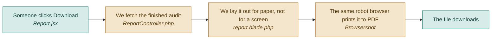

# F10 — PDF export

**One line:** A download button that produces a document an agency can email to a client.

- **Mode:** build · **Status:** V1 export built · DropSense adds the header and the rewrites · **Epic:** `#77`
- **Spec:** [`../superpowers/specs/2026-08-03-dropsense-ai-design.md`](../superpowers/specs/2026-08-03-dropsense-ai-design.md)
- **Tasks:** `kanban-md list --compact --tag f10-pdf`

## Flow

**Why the server, not the browser.** Rendering in the visitor's browser makes the layout
differ from person to person. Rendering on the server makes it identical everywhere.

**Why a separate print layout, not the React screen.** Paper has different needs from a
screen: no hover, no clicking through to a finding, fixed width, page breaks that fall in
sensible places. Printing the React page produces something that looks like a screenshot
of a website, not a document.

**Why this is cheap to build.** Browsershot drives the same Chromium already installed
for taking screenshots. There is no new dependency.

## What "done" means

- [ ] **The file downloads** — clicking Download produces a PDF, not an error · `#104`
- [ ] **It carries the substance** — the score, the top fixes and the section pictures are all in it · `#104`
- [ ] **It looks the same everywhere** — open it on a second machine and the layout is identical · `#104`
- [ ] **It is short enough to read** — two or three pages, not twenty · `#104`
- [ ] **The header says DropSense AI**, and the number is called the Conversion Score · `#124`
- [ ] **It carries the rewrites** — where a rewrite was generated, the old and new copy are both in the document. This is the part a client can act on without opening the app · `#132`

## Tests

No automated test in V1. This is the lowest-priority feature and the failure mode is
visible the instant you open the file. Verify by hand against the checklist above.

If PDF export becomes load-bearing for a customer, the test to write is a feature test
asserting the endpoint returns a `application/pdf` content type and a non-trivial body
length.

## Known gaps and debt

| # | Item | Priority |
|---|---|---|
| — | No automated test. Acceptable for V1; note it if this feature ever matters to a paying customer | low |
| — | Generating the PDF holds a Chromium process. Fine at demo scale; it would need to move onto the queue before any real traffic | medium |
| `#114` | The PDF embeds screenshots that may contain customer data, and nothing currently expires them | high |
