# F11 — AI copy rewrite

**One line:** The report shows the page's real headline and button text, and one click returns two or three better versions, each with a reason.

- **Mode:** plan · **Status:** planned — new in DropSense · **Epic:** `#123`
- **Spec:** [`../superpowers/specs/2026-08-03-dropsense-ai-design.md`](../superpowers/specs/2026-08-03-dropsense-ai-design.md)
- **Tasks:** `kanban-md list --compact --tag f11-rewrite`

> This is the **Fix** in Detect → Explain → Fix. Everything before F11 tells the user
> what is wrong. F11 is the only part that hands them something they can paste.

## Flow

```mermaid
flowchart LR
    A["Capture already read the page's own words<br/><i>F04, screenshot_sections.copy</i>"] --> B["The report shows the headline and button as text"]
    B --> C["Someone clicks Rewrite this"]
    C --> D["We send the words, the critique of that section,<br/>and the number that proves it is failing<br/><i>RewriteService.php</i>"]
    D --> E["Two or three versions come back, each with a reason"]
    E --> F["We check the reply before saving a row<br/><i>schema validation</i>"]
    F --> G["Stored, so the second click is free<br/><i>rewrites table</i>"]
    classDef have fill:#d7ebe8,stroke:#0f766e,color:#0f3d38;
    classDef ai fill:#f4e6cc,stroke:#b5771f,color:#5a3d0d;
    classDef guard fill:#f3d9d5,stroke:#c0392b,color:#6d211a;
    class A,B,G have;
    class C,D,E ai;
    class F guard;
```

## Why this is not a thesaurus

A rewrite tool that is handed only the old headline can only guess at style. This one is
handed three things:

| Input | Comes from | What it buys |
|---|---|---|
| The original words | F04's crawl | It rewrites what is actually on the page, not a paraphrase of a screenshot |
| The AI's critique of that section | F05 | It knows the headline is vague, or the button says *Submit* |
| The correlation insight attached to it | F06 | It knows **80% of visitors see this button and 2% click it** |

That third input is the product. The rewrite is told *why* the copy is failing, in
numbers, and its stated reason has to refer to that.

## Why it is not in the pipeline

The audit chain is four stages and stays four stages. A rewrite generated during every
audit is billed whether or not anyone reads it — and, worse, it turns step 7 of the demo
from *the AI does something now* into *here is something we prepared earlier*.

It runs on click, against its own endpoint, after the report already exists.

## What happens when the wifi dies

**The seeded example page ships with its rewrites already stored.** If the live call
fails, the panel shows the stored variants and says plainly that the live call failed.

This is not politeness about error states. Step 7 of the demo flow is a live model call
in a venue you do not control.

## Which model

Three drivers — `stub`, `gemini`, `claude` — chosen by `AI_REWRITE_DRIVER`, which is a
separate switch from `AI_DRIVER` so the expensive vision pass can stay on stub while this
one is real.

`GeminiCopyRewriter` exists so a deployment can run on one provider. Until it did, the
container had only `'claude'` and a `default`, and `AI_REWRITE_DRIVER=gemini` fell through
to the stub — canned copy served from a button that looked live, with nothing logged and
nothing failed. Since `rewrite_driver` defaults to whatever `AI_DRIVER` is, simply going
live on Gemini was enough to trigger it.

**An unrecognised driver now throws, naming itself and listing the valid ones.** That
applies to `AI_DRIVER` and `CAPTURE_DRIVER` too. A typo surfaces on the first request
after a deploy instead of silently downgrading the product.

## Cost

One text-only call, roughly a tenth of a cent. Stored on first use, so a second click on
the same headline costs nothing. On a thinking model the thinking tokens are counted as
output, the same as in F05 — a rewrite that spends 700 of them and 200 on the visible
reply is billed for both.

## What "done" means

- [ ] **It rewrites the real words** — the panel shows the headline that is actually on the page, not a description of it · `#127` `#128`
- [ ] **Every version carries a reason** — one line saying why it should work better, referring to the critique or the number · `#130`
- [ ] **The reason cites the evidence** — where an insight exists for that section, the reason names its number · `#130`
- [ ] **A malformed reply saves nothing** — a reply missing the variants array, or a variant missing its reason, throws and writes no row · `#130` `#136`
- [ ] **The second click is free** — clicking Rewrite again returns the stored versions without a second model call · `#131` `#138`
- [ ] **No blank area while it thinks** — a loading state, then the versions · `#132`
- [ ] **A dead network does not break the demo** — with the wifi off, the seeded page still shows its stored versions and says the live call failed · `#132` `#140`
- [ ] **The PDF carries them** — an exported report includes any rewrites that were generated · `#132`

## Tests

| # | Kind | What it proves | Target file |
|---|---|---|---|
| `#136` | unit | A malformed model reply is rejected, not half-saved | `tests/Unit/Rewrite/RewriteSchemaTest.php` |
| `#138` | feature | The endpoint returns the documented shape; a repeat call returns stored variants without a second model call; an unknown section returns 422 | `tests/Feature/RewriteEndpointTest.php` |
| — | feature | The Gemini driver returns the versions the model wrote, counts thinking tokens, and turns a refusal or a non-JSON reply into a real error | `tests/Feature/GeminiRewriterTest.php` |
| — | feature | An unrecognised driver name throws and lists the valid ones, for all three switches; every real driver still resolves | `tests/Feature/UnknownDriverThrowsTest.php` |

## Known gaps and debt

| # | Item | Priority |
|---|---|---|
| — | Only hero headline, subhead and main button can be rewritten. Rewriting every section is a wall of text nobody reads on stage, and multiplies the cost per audit | low |
| — | Nothing measures whether a rewrite actually converted better. That needs before-and-after audits — `#119` | medium |
| — | The rewrite is generated from the critique, not from the brand's voice. There is no tone or brand-guideline input | medium |
