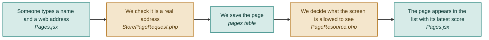

# F01 — Landing pages (add and list)

**One line:** Somewhere to paste a landing page address and see the pages you have added.

- **Mode:** plan · **Status:** planned — nothing built yet · **Epic:** `#68`
- **Visual doc:** [`v1.dashboard.html`](v1.dashboard.html) — open it in a browser
- **Tasks:** `kanban-md list --compact --tag f01-pages`

## Flow

**Why a Resource, never the model.** A Resource class is the only place that decides what
the browser sees. That means adding a database column later can never accidentally leak it
into the API.

## What "done" means

- [ ] **A page can be added** — paste a name and a URL, and it appears in the list · `#81` `#85`
- [ ] **A bad address is caught by the server** — type `not-a-url`, and the error appears under the URL input, read from the server's 422 reply · `#81` `#85`
- [ ] **Validation is not written twice** — the browser does not re-implement the rules; the server is the only place validation is real · `#85`
- [ ] **The list shows something useful** — each row carries the latest health score as a chip, or a dash if the page has never been audited · `#85`
- [ ] **No blank white area** — loading skeleton, empty state, and an error state with a retry all render · `#85`

## Tests

| # | Kind | What it proves | Target file |
|---|---|---|---|
| `#110` | feature | A valid page is created and returned; an invalid URL returns 422 with a field-level message | `tests/Feature/AuditEndpointsTest.php` |
| `#111` | e2e | Add a page in the browser and see it in the list | `tests/e2e/audit-flow.spec.ts` |
| `#112` | e2e | An empty URL shows an error under the field, not just a toast | `tests/e2e/unhappy-path.spec.ts` |

## Known gaps and debt

| # | Item | Priority |
|---|---|---|
| `#113` | No `user_id` on pages and no policy — every page is visible to everyone | critical |
| — | The optional `section_selectors` field exists in the table but has no UI in V1. It is the escape hatch when automatic section detection guesses badly (see `#88`) | medium |
