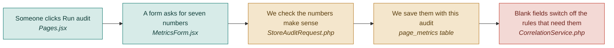

# F02 — Metrics input form

**One line:** A short form where the user types the seven numbers from their analytics, filled in at the moment they run an audit.

- **Mode:** plan · **Status:** planned — nothing built yet · **Epic:** `#69`
- **Visual doc:** [`v1.dashboard.html`](v1.dashboard.html) — open it in a browser
- **Tasks:** `kanban-md list --compact --tag f02-metrics`

## Flow

**Why a form and not Google Analytics.** Google Analytics does export reports as CSV, but
its export carries comment lines above the table and column names that shift by report.
More importantly, it does not contain the two numbers the rules care about most —
scroll depth per section, and how often the main button is clicked (which needs an event
most landing pages never set up). So V1 asks directly. Pulling from Google Analytics is
`#117`.

**Why at audit time, not on the page record.** The numbers change every week. The page
does not.

## The seven fields

| Field | Required | What it switches on |
|---|---|---|
| Visitors | yes | How much weight a section's problems carry in the ranking |
| Bounce rate | yes | The trust rule, and the user-experience score |
| Conversion rate | yes | Context at the top of the report |
| Main button click rate | no | The seen-but-not-clicked rule |
| Share of visitors on a phone | no | The mobile rule |
| Bounce rate on a phone | no | The mobile rule |
| How far down each section people get | no | The buried-section rule |

## What "done" means

- [ ] **Three fields are enough** — an audit runs with only visitors, bounce rate and conversion rate filled in · `#82` `#86`
- [ ] **A blank field is never a guess** — leave the button click rate blank and the seen-but-not-clicked rule does not fire at all; the report says not measured · `#82` `#86`
- [ ] **Nonsense is rejected** — a bounce rate of 150 returns a field error, not a saved row · `#82`
- [ ] **Every number is explained** — each field carries a one-line plain-English note saying what it means, e.g. bounce rate is the share of visitors who arrive and leave without doing anything · `#86`
- [ ] **Optional fields say what they cost** — each optional field says in one line what stops working if it is left blank · `#86`

## Tests

| # | Kind | What it proves | Target file |
|---|---|---|---|
| `#110` | feature | Only the three required fields are needed; a bounce rate of 150 returns 422 | `tests/Feature/AuditEndpointsTest.php` |
| `#106` | unit | A blank button click rate makes the seen-but-not-clicked rule silent rather than assuming a value | `tests/Unit/Correlation/SeenButNotClickedRuleTest.php` |
| `#112` | e2e | Running an audit with every optional field blank produces a report that says not measured | `tests/e2e/unhappy-path.spec.ts` |

## Known gaps and debt

| # | Item | Priority |
|---|---|---|
| `#117` | Pulling the numbers from Google Analytics instead of typing them | medium |
| `#118` | Microsoft Clarity, which would supply scroll depth and rage clicks automatically | medium |
| — | Per-section reach is entered as free text in V1. It becomes tedious past three or four sections | medium |
