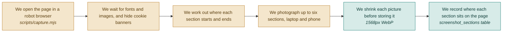

# F04 — Screenshot capture

**One line:** A robot browser opens the page and photographs each section, on a laptop screen and on a phone.

- **Mode:** plan · **Status:** planned — nothing built yet · **Epic:** `#71`
- **Visual doc:** [`v1.dashboard.html`](v1.dashboard.html) — open it in a browser
- **Tasks:** `kanban-md list --compact --tag f04-capture`

## Flow

**Why hide the cookie banner.** A photograph of a cookie wall teaches the AI nothing
about the page underneath it.

**Why the phone shot is not optional.** Mobile is usually where the conversion is lost.

**Finding the sections, three levels in order:**

1. Selectors the user typed in — most accurate
2. `<section>` tags and large landmark blocks
3. Slicing the page into equal horizontal bands, labelled by position

Stop at six sections whatever happens, so cost and waiting time stay bounded.

**Why the position matters.** The buried-section rule (`#95`) is built entirely on how
far down the page a section sits. A wrong number there produces a confidently wrong
insight, which is worse than no insight.

## What "done" means

- [ ] **Every section is photographed** — you can see up to six named sections plus one full-page phone shot · `#88` `#89`
- [ ] **The pictures are clean** — no cookie banner, no half-loaded images, no missing fonts · `#88`
- [ ] **Positions are recorded honestly** — each section row carries how far down the page it starts and how tall it is, measured not guessed · `#89`
- [ ] **Load timing is captured** — recorded during the same visit, because the health score needs it and it is free at this point · `#88`
- [ ] **Images are shrunk before they cost money** — every stored screenshot is WebP with a long edge of 1568px or less · `#90`
- [ ] **Links expire** — the browser receives temporary signed URLs, never a raw disk path · `#90`

## Tests

Capture is covered end to end rather than by unit tests — it depends on a real browser
against a real page, which is exactly what the e2e test drives.

| # | Kind | What it proves | Target file |
|---|---|---|---|
| `#111` | e2e | After an audit, section cards show real screenshots next to their findings | `tests/e2e/audit-flow.spec.ts` |
| `#110` | feature | Screenshot URLs in the report are signed and time-limited, never raw disk paths | `tests/Feature/AuditEndpointsTest.php` |

## Known gaps and debt

| # | Item | Priority |
|---|---|---|
| `#114` | Screenshots pile up on local disk with no lifecycle rule deleting them, and may contain customer data | high |
| — | Automatic section detection can produce meaningless bands on an unusual page. The escape hatch is the selectors field, which has no UI in V1 (see `#81`) | medium |
| — | Screenshotting a page you do not own may breach its terms of service. Fine for your own pages; check before adding competitor comparison | medium |
