# F04 — Capture

**One line:** A robot browser opens the page once and takes everything it can from that one visit — the pictures, the page's own words, and a Lighthouse run.

- **Mode:** build · **Status:** built — crawl and Lighthouse shipped; capture fixed on real pages `#143` · **Epic:** `#71`
- **Spec:** [`../superpowers/specs/2026-08-03-dropsense-ai-design.md`](../superpowers/specs/2026-08-03-dropsense-ai-design.md)
- **Tasks:** `kanban-md list --compact --tag f04-capture`

> **One browser, three jobs.** The page is already open and already loaded. Reading its
> headline is one `page.evaluate`; Lighthouse attaches to the same browser over CDP. A
> separate crawl stage would open a second browser to re-fetch a page we already have,
> and a separate Lighthouse stage would open a third.

## Flow

```mermaid
flowchart LR
    A["We open the page in a robot browser<br/><i>scripts/capture.mjs</i>"] --> B["We wait for fonts and images, and hide cookie banners"]
    B --> C["We work out where each section starts and ends"]
    C --> D["We photograph up to six sections, laptop and phone"]
    D --> E["We read each section's own words<br/><i>headline, subhead, buttons</i>"]
    E --> F["We run Lighthouse against the same browser"]
    F --> G["We shrink each picture before storing it<br/><i>1568px WebP</i>"]
    G --> H["We record position, words and scores<br/><i>screenshot_sections + audits</i>"]
    classDef browser fill:#f4e6cc,stroke:#b5771f,color:#5a3d0d;
    classDef store fill:#d7ebe8,stroke:#0f766e,color:#0f3d38;
    class A,B,C,D,E,F browser;
    class G,H store;
```

**Why hide the cookie banner.** A photograph of a cookie wall teaches the AI nothing
about the page underneath it.

**Why the phone shot is not optional.** Mobile is usually where the conversion is lost.

**Finding the sections, three levels in order:**

1. Selectors the user typed in — most accurate
2. `<section>` tags and large landmark blocks
3. Slicing the page into equal horizontal bands, labelled by position

Stop at six sections whatever happens, so cost and waiting time stay bounded.

**Why the position matters.** The buried-section rule (`#95`) is built entirely on how
far down the page a section sits. A wrong number there produces a confidently wrong
insight, which is worse than no insight.

## Reading the page's own words (`#127` `#128`)

Screenshots give pixels. You cannot rewrite a headline you never read, so F11 depends
entirely on this.

Inside each detected section we keep the first heading, the paragraph after it, and
every button or link that reads as a call to action — with its text, its tag and a CSS
selector. **Capped at one headline, one subhead and three buttons per section**, because
a footer with forty links must not become forty rewrite targets.

**When there is no heading** — common on Webflow and React marketing pages, where the
biggest text on screen is a styled `
` — we take the largest text by rendered font
size within that section. Less precise, never empty.

Stored as a nullable `copy` JSON column on `screenshot_sections`. No new table: the
page's words are an attribute of a section we already record.

## Lighthouse (`#129`)

Launch the capture browser with a remote debugging port; once the screenshots are taken,
Lighthouse attaches to that same browser. Store performance, accessibility, best
practices and SEO, plus the two or three worst-scoring checks, as a nullable
`lighthouse` JSON column on `audits`.

**A note on the word.** Lighthouse calls its individual checks *audits* too. In this
codebase an audit is always a row in the `audits` table; Lighthouse's are *checks*.

**It is allowed to fail.** Timeout, and the capture still succeeds with the column left
null. F08 then falls back to V1 scoring and marks those two categories *estimated*. No
audit dies because a Lighthouse run hung.

**Cost:** capture goes from roughly 25 seconds to roughly 45. That sits inside the
existing five-second progress polling, so nobody watches a frozen screen — the stage
label just reads *capturing* for longer.

## What running it against real pages changed (`#143`)

Every one of these was invisible to the test suite and obvious the first time a
real landing page went through. They are the reason the rule is now *no
capture-touching change ships without a real URL behind it*.

| Symptom | Cause | Fix |
|---|---|---|
| **Every real page failed to capture at all** | `page.screenshot({clip})` without `fullPage` measures the clip against the *viewport*. Any section below 900px was "outside the resulting image". The e2e fixture was short enough that all its sections fit on one screen, so the suite stayed green | `fullPage: true`, which makes the clip page-relative — the coordinate space the measured section positions were already in |
| Heavy pages timed out | `waitUntil: 'load'` waits for every image, font and third-party iframe. stripe.com's load event measured **31.8s**; over 45s killed the audit | `domcontentloaded`, then the existing scroll-and-settle |
| The same section appeared twice | Dedupe gap was a fixed 120px — nothing on a 14,000px page | Gap scales with page height, and a repeated heading is rejected outright |
| Names cut mid-word: *"…to grow your re"* | Hard 40-character slice | Cut at a word boundary |
| A 300-character "button label" | `<button>` skipped the CTA word cap, and real sites wrap whole feature cards in one | The cap applies to buttons too |

**Measured cost on real pages:** 72–121 seconds end to end with Lighthouse, not
the ~45s originally estimated. Lighthouse is the slow half. The seeded audit is
what keeps this off the demo's critical path.

**Lighthouse failing is survivable, and that is not theoretical:** vercel.com's
run timed out and its audit still completed, with the two categories falling
back to labelled estimates.

## The phone shot is clamped

Asked for one image taller than it can allocate — a little over 16,000px — Chromium
writes a file of **zero bytes and raises nothing**. The desktop sections have clamped to
2400px since they were written; the phone shot was taking `fullPage: true` with no clip.

stripe.com's phone layout runs past 20,000px, so its audit captured cleanly, passed
every check, and then died at the AI call with *"Unable to process input image (400)"* —
minutes and one browser launch after the actual mistake, with the error naming nothing
useful. The shot is now clipped to 12,000px. Nobody judges a phone layout on its
18,000th pixel, and `page_height` still records the real height, so the scroll-depth
rules are unaffected.

`PromptBuilder` also refuses to send a zero-byte file at all, so a disk that fills up or
a killed process costs one image rather than the whole audit.

## What "done" means

- [ ] **Every section is photographed** — you can see up to six named sections plus one full-page phone shot · `#88` `#89`
- [ ] **The pictures are clean** — no cookie banner, no half-loaded images, no missing fonts · `#88`
- [ ] **Positions are recorded honestly** — each section row carries how far down the page it starts and how tall it is, measured not guessed · `#89`
- [ ] **Load timing is captured** — recorded during the same visit, because the health score needs it and it is free at this point · `#88`
- [ ] **Images are shrunk before they cost money** — every stored screenshot is WebP with a long edge of 1568px or less · `#90`
- [ ] **Links expire** — the browser receives temporary signed URLs, never a raw disk path · `#90`
- [ ] **The page's own words come back** — for a real landing page, the report shows its actual hero headline and button text, as text · `#127` `#128`
- [ ] **A page with no `<h1>` still yields a headline** — the largest-text fallback returns something rather than nothing · `#127`
- [ ] **The cap holds** — a section with thirty links produces at most three button entries · `#127`
- [ ] **Lighthouse runs in the same visit** — one browser launch, four scores stored on the audit · `#129`
- [ ] **A dead Lighthouse run is survivable** — kill it mid-run and the audit still completes, with the score breakdown marked estimated · `#129` `#137`

## Tests

Capture is covered end to end rather than by unit tests — it depends on a real browser
against a real page, which is exactly what the e2e test drives.

| # | Kind | What it proves | Target file |
|---|---|---|---|
| `#111` | e2e | After an audit, section cards show real screenshots next to their findings | `tests/e2e/audit-flow.spec.ts` |
| `#110` | feature | Screenshot URLs in the report are signed and time-limited, never raw disk paths | `tests/Feature/AuditEndpointsTest.php` |
| `#137` | unit | With no Lighthouse data, the audit still completes and the breakdown says estimated | `tests/Unit/HealthScorerTest.php` |

## Known gaps and debt

| # | Item | Priority |
|---|---|---|
| `#114` | Screenshots pile up on local disk with no lifecycle rule deleting them, and may contain customer data | high |
| — | Automatic section detection can produce meaningless bands on an unusual page. The escape hatch is the selectors field, which has no UI in V1 (see `#81`) | medium |
| — | Screenshotting a page you do not own may breach its terms of service. Fine for your own pages; check before adding competitor comparison | medium |
| — | Capture at ~45s is the slowest thing in the product, and Lighthouse is the slow part. The seeded example audit is what keeps this off the demo's critical path | medium |
| — | The crawl reads what the browser rendered. A page that builds its hero after a user interaction will yield the pre-interaction copy | low |
