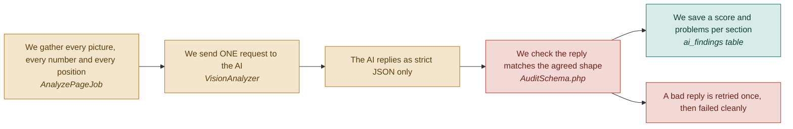

# F05 — AI vision analysis

**One line:** One AI call looks at every section of the page at once, with the visitor numbers attached, and says what is wrong.

- **Mode:** plan · **Status:** planned — nothing built yet · **Epic:** `#72`
- **Visual doc:** [`v1.dashboard.html`](v1.dashboard.html) — open it in a browser
- **Tasks:** `kanban-md list --compact --tag f05-ai-vision`

## Flow

## The clever bit, and the cheap bit

**The AI never looks at a picture alone.** Every image arrives with its own numbers
attached — *82% of visitors saw this section, only 2% clicked the button*. That pairing
is what turns a design opinion into evidence.

**One call, not thirteen.** The original plan sent one request per section per screen
size, plus a separate whole-page request — thirteen in total, each re-sending the same
~1,500-word instruction. Sending everything in one request costs roughly a quarter as
much *and* gives the model the whole-page view the separate request was there to buy.

| Shape | Requests | Rough cost per audit |
|---|---|---|
| One request per section, plus a whole-page pass | 13 | ~$0.22 |
| **One request, everything together** | **1** | **~$0.055** |

The second cost lever lives in F04: shrinking images to 1568px before sending. A
full-size image can cost around three times as many image tokens as a shrunk one, and
judging whether a button has enough contrast does not need the extra pixels.

## Two models, one prompt

`VisionAnalyzer` is an interface with two drivers sharing one instruction and one reply
shape. Only the HTTP client differs; pick with `AI_DRIVER` in `.env`.

| Driver | Model | Used for |
|---|---|---|
| `GeminiVisionAnalyzer` | Gemini 2.5 Flash (free tier) | The build week |
| `ClaudeVisionAnalyzer` | Claude Sonnet 5 | The demo |

**What the AI is asked to judge:** layout and hierarchy, the main button (visible,
large enough, enough contrast, clear words), typography, design consistency and mobile
friendliness, trust signals, and content clarity.

**What each problem must come back with:** what is wrong, why it costs conversions,
what to change, and how bad it is on a scale of one to five. F07 composes the
user-facing fix out of those four fields — there is no second AI call.

## What "done" means

- [ ] **Exactly one AI request per audit** — the log shows a single vision call, and the audit's token cost is recorded · `#92`
- [ ] **The AI says something specific** — every section has a score from 0 to 100 and at least one problem naming an actual element, not generic advice like improve your design · `#92`
- [ ] **A malformed reply is rejected, not half-saved** — feed it a reply missing a severity field; it retries once, then fails cleanly, and no findings rows are written · `#92` `#109`
- [ ] **Swapping the model is one line** — flipping `AI_DRIVER` between gemini and claude changes nothing else · `#91`
- [ ] **You know what an audit costs** — the token cost is stored per audit, before anyone asks · `#92`

## Tests

| # | Kind | What it proves | Target file |
|---|---|---|---|
| `#109` | unit | A well-formed reply validates; missing fields, out-of-range scores and non-JSON are all rejected without writing rows | `tests/Unit/Ai/AuditSchemaTest.php` |
| `#111` | e2e | Section cards show a score and a specific problem after a real run | `tests/e2e/audit-flow.spec.ts` |

## Known gaps and debt

| # | Item | Priority |
|---|---|---|
| `#115` | No hard ceiling on spend per audit, and nothing rate-limits how often one can run | high |
| — | **Biggest open risk in the project:** the model writing the critique *is* the demo. Whichever driver you present with must be run against at least four real landing pages, and the output read as a judge would read it. Day 6 is reserved for exactly this | critical |
| — | Free-tier requests are rate-limited and free-tier data may be used for product improvement. Fine for public landing pages; check the current quota page before relying on it | medium |
