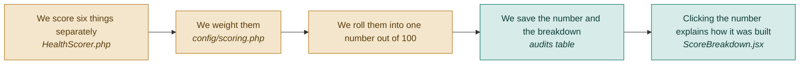

# F08 — Health score

**One line:** One number out of 100 for the whole page, built from six weighted categories that are visible in the app so nobody thinks the number is magic.

- **Mode:** plan · **Status:** planned — nothing built yet · **Epic:** `#75`
- **Visual doc:** [`v1.dashboard.html`](v1.dashboard.html) — open it in a browser
- **Tasks:** `kanban-md list --compact --tag f08-score`

## Flow

## The six categories

| Category | Weight | Where the score comes from |
|---|---|---|
| Main button effectiveness | 25% | AI judgment plus the real click rate |
| User experience | 20% | Bounce rate and how far down people get |
| Visual design | 20% | AI judgment across every section |
| Trust | 15% | AI judgment — testimonials, logos, badges |
| Speed | 10% | The load timing measured while photographing |
| Accessibility | 10% | AI judgment on contrast and font size |

The weights live in `config/scoring.php` and are shown in the app. A number nobody can
take apart is a number nobody should trust.

## What the number is actually for

**79 means nothing on its own. 79 last month and 86 today means the fixes worked.**

V1 can only ever show the first half of that sentence, because it has one audit per
page. The comparison — the score's real job — arrives with `#119`. Worth saying out
loud on stage rather than implying the single number carries more meaning than it does.

## The honesty problem, stated plainly

**The accessibility score is an AI approximation, not an accessibility audit.** It comes
from a vision model judging contrast and font size, not from running real accessibility
checks. Speed has the same weakness: a single load timing, not a full performance audit.

V1 keeps both numbers and labels them as estimates in the breakdown. The fix is to run
real accessibility checks inside the browser that is already open during capture — that
is `#116`. Removing the false impression matters more than removing the number.

## What "done" means

- [ ] **The score shows its working** — clicking the number lists all six categories, their weights and their individual scores · `#100`
- [ ] **The weights add up** — the six weights sum to exactly 100 · `#100` `#108`
- [ ] **The total is the weighted average** — recompute by hand from the breakdown and get the same number, rounded · `#100` `#108`
- [ ] **Missing data does not silently score zero** — a category with nothing to judge is excluded rather than dragging the total down · `#100` `#108`
- [ ] **Accessibility is labelled as an estimate** — the breakdown says so in the interface, not only in this document · `#100` `#116`

## Tests

| # | Kind | What it proves | Target file |
|---|---|---|---|
| `#108` | unit | Weights sum to 100; the total is the weighted average, rounded; a data-less category does not score zero | `tests/Unit/HealthScorerTest.php` |
| `#110` | feature | The report response carries both the overall score and the per-category breakdown | `tests/Feature/AuditEndpointsTest.php` |

## Known gaps and debt

| # | Item | Priority |
|---|---|---|
| `#116` | The accessibility score is a guess wearing a number. Run real accessibility checks in the browser that is already open | high |
| `#119` | No score history, so the comparison the number exists for cannot be shown | medium |
| — | Speed is one load timing, not a full performance audit. Same honesty caveat, smaller weight | medium |
